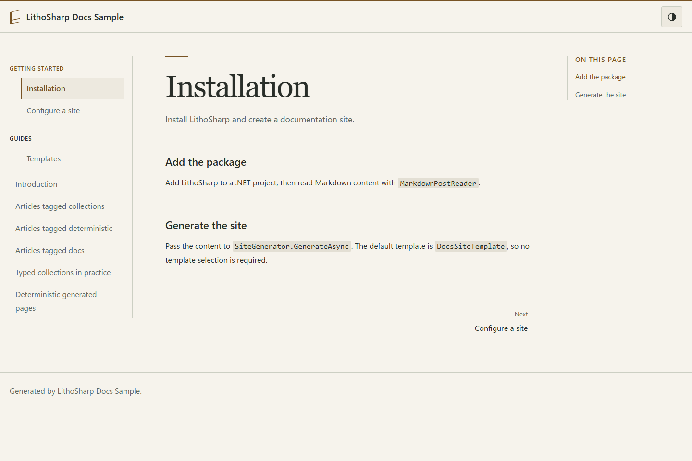

# LithoSharp Docs サンプル



テーマ切り替えは既定で有効です。`SiteThemeOptions.EnableThemeSwitching = false` で無効にできます。
[固定ダーク配色を含む設定例](../../docs/layout-css-contract.md#theme-switching--テーマ切り替え)を参照してください。

標準のDocsテンプレートは、石版をイメージした見出しと配色を採用しています。
ライト・ダークの切り替えはヘッダーから行えます。選択はブラウザーに保存され、
未選択の場合はOSの配色設定に従います。

`DocsSampleFactory` を使って、サイトをテストプロセス内で生成できます。
出力先とキャッシュは一時領域へ隔離し、外部リンクの検証は既定で無効です。
テストプロジェクトからこのサンプルと `LithoSharp.Testing` を参照し、
次の例をリポジトリのルートで実行します。

## ファクトリのテスト

```csharp
using LithoSharp;
using LithoSharp.Testing;

await using var host = await SiteTestHost.CreateAsync(
    new DocsSampleFactory { AssetDemo = true },
    new SiteFactoryContext(Path.GetFullPath("samples/LithoSharp.DocsSample")));
host.AssertSucceeded();
host.AssertRoute("/index.html", "index.html");
using var page = await host.OpenPageAsync("/index.html");
page.AssertElement("main");
```

`AssetDemo = true` では、画像変換と独自の記事レイアウトも検証できます。
検証失敗時は `Succeeded` がfalse、`Result` がnullになり、診断を保持します。
描画処理そのものの例外は呼び出し元へ伝播します。
各検証APIとエラー条件は[テストガイド](../../docs/testing.ja.md)を参照してください。
