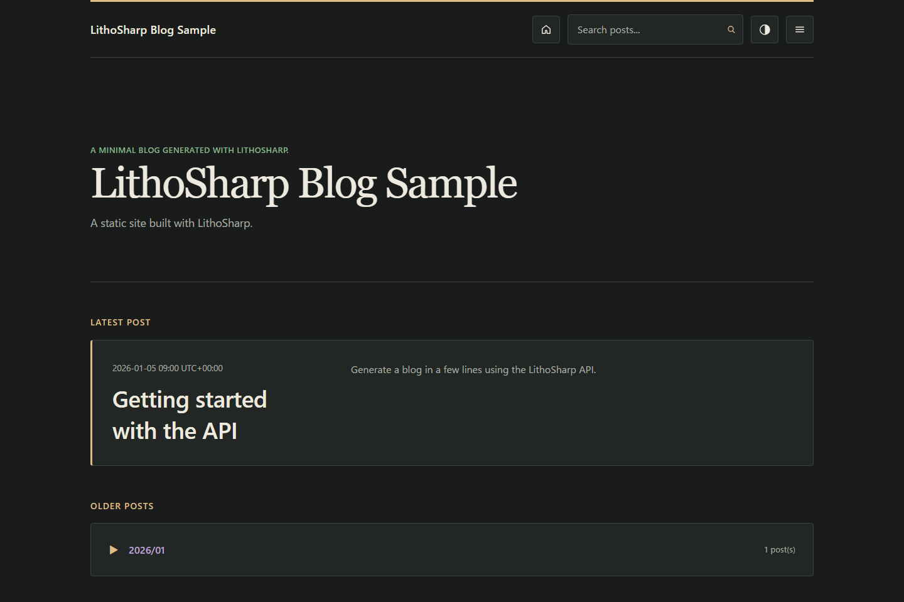

# LithoSharp Blog サンプル



テーマ切り替えは既定で有効です。`SiteThemeOptions.EnableThemeSwitching = false` で無効にできます。
[固定ダーク配色を含む設定例](../../docs/layout-css-contract.md#theme-switching--テーマ切り替え)を参照してください。

記事一覧・本文・アーカイブ・タグ・検索を備えたブログテンプレートです。
見出しと余白を重視したレイアウトを採用し、ライト・ダークの配色を切り替えられます。
初回はOS設定に従い、ヘッダーから選んだ配色をブラウザーに保存します。

`BlogSampleFactory` は通常実行とテストで同じサイト定義を返します。
テストプロジェクトからこのサンプルと `LithoSharp.Testing` を参照し、
次の例をリポジトリのルートで実行します。既存のサンプル用コマンドライン
オプションも利用できます。

## ファクトリのテスト

```csharp
using LithoSharp;
using LithoSharp.Testing;

await using var host = await SiteTestHost.CreateAsync(
    new BlogSampleFactory(),
    new SiteFactoryContext(Path.GetFullPath("samples/LithoSharp.Sample")));
host.AssertSucceeded();
host.AssertRoute("/index.html", "index.html");
using var page = await host.OpenPageAsync("/index.html");
page.AssertElement("main");
```

出力先とキャッシュを隔離し、外部リンクの検証は既定で無効にします。
成果物と診断の検証、失敗時の扱いについては、
[テストガイド](../../docs/testing.ja.md)を参照してください。
